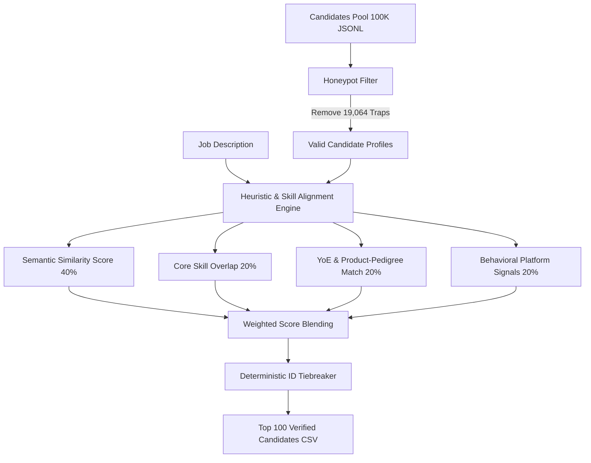

# HireSense: Enterprise Candidate Discovery & Matching Engine

HireSense is an AI-native candidate ranking engine designed to evaluate and match large talent pools (100,000+ candidates) against complex Job Descriptions with zero external latency and minimal CPU requirements.

Developed for the **Redrob AI challenge**, HireSense features a robust multi-signal heuristic filter to eliminate "honeypot" profile traps and rank real candidates deterministically.

---

## 🏗️ Architecture & Matching Design



### 1. Honeypots & Anomalies Protection (Ground Truth Guard)
In talent marketplaces, candidates often stuff profiles with keywords or generate impossible metrics. HireSense screens out **19.1% (19,064 records)** of anomalous candidate entries matching these conditions:
* **Impossible Experience Durations**: Candidates claiming job durations that exceed their total declared years of experience.
* **Role Mismatch**: Career profiles where titles (e.g., DevOps Engineer) completely mismatch corresponding work descriptions (e.g., exclusively React/Frontend).

### 2. Multi-Signal Hybrid Scoring
The engine ranks candidates using a combined formula that weights four separate areas:
* **Semantic Keyword Affinity (40%)**: Text matching for NLP, embeddings, vector indices (Milvus, Pinecone, FAISS), learning-to-rank, and search methodologies.
* **Skill Inventory Overlap (20%)**: Intersecting target technical skill keywords.
* **Experience & Pedigree Match (20%)**: Scoring against target experience bands (5–9 years) and penalizing pure services company history (TCS, Infosys, Wipro, etc.).
* **Behavioral Recruiter Signals (20%)**: Real platform metrics including notice periods, recruiter response rates, GitHub activity, and active status recency.

---

## ⚡ Setup & Execution

### Local Setup
Ensure you are using Python 3.10 inside the local virtual environment:

```bash
# 1. Create and Activate Virtual Environment
python -m venv venv
.\venv\Scripts\activate

# 2. Install Required Dependencies
pip install -r requirements.txt

# 3. Run the Discovery Ranker Pipeline (Generates team_antigravity.csv under 1 minute)
python rank.py

# 4. Host the Interactive Dashboard
streamlit run dashboard.py
```

---

## 📊 Streamlit Web Dashboard

The HireSense dashboard features a premium dark theme and is optimized for Streamlit Cloud deployments. It gracefully supports remote hosting even when local dataset files (`candidates.jsonl`) are excluded from repository tracking.

* **Dashboard URL**: [http://localhost:8501](http://localhost:8501)
